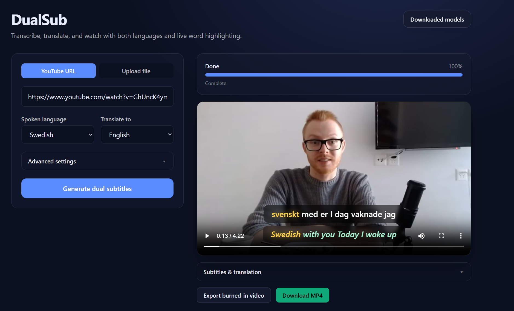
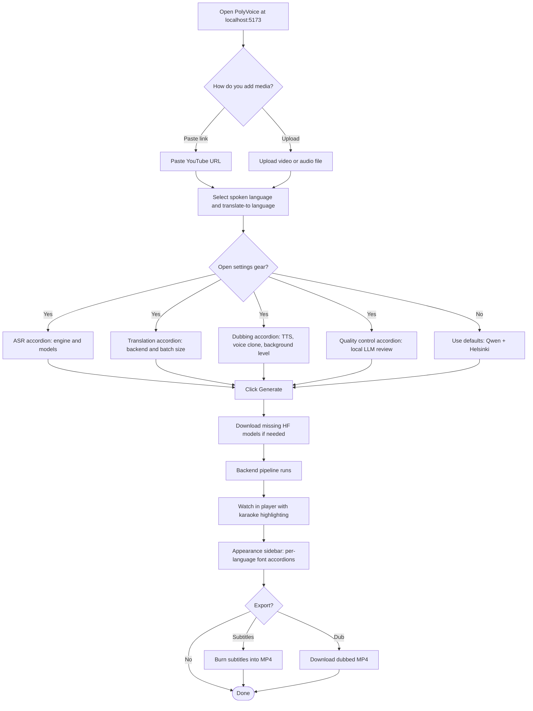

# PolyVoice

**Local AI pipeline for transcription, translation, subtitles and dubbing.** Transcribe speech with **Qwen3-ASR**, **Whisper**, or **Nemotron 3.5**, translate with Helsinki-NLP, **NLLB-200**, or optional LLM backends, optionally refine translations via a **local LLM** (LM Studio, Ollama, or llama.cpp), and play the result in a web player with **two subtitle tracks** and **live word-by-word karaoke highlighting**. **Dubbing mode** synthesizes translated speech with Qwen3-TTS, Kokoro, VoxCPM2, OmniVoice, or an external Higgs TTS server, separates vocals from background music early via **Demucs**, mixes dubbed speech with adjustable background level, and muxes into the video. Customize subtitle colors and fonts in the preview sidebar and export. Export a high-quality burned-in MP4 when you are done.

Everything runs on your machine — no cloud API keys required for the core workflow.

---

## Features

| Capability | Details |
|---|---|
| **Input** | YouTube URL (`yt-dlp`, highest available quality) or local video/audio upload |
| **ASR engines** | **Qwen3-ASR**, **Whisper** (incl. large-v3-turbo), or **Nemotron 3.5** (40 locales) |
| **Word timestamps** | Qwen: Forced Aligner · Whisper: built-in · Nemotron: token timestamps → words |
| **Translation** | Helsinki `opus-mt`, **NLLB-200** (4 sizes), Hunyuan Hy-MT2, or TranslateGemma 4B |
| **Subtitle styling** | Font, color, bold/italic, karaoke colors — synced to player and MP4 export |
| **GPU memory** | ASR model is unloaded from VRAM before translation starts |
| **Quality control** | Optional back-translation + local LLM review (LM Studio, Ollama, llama.cpp) |
| **Player** | Dual subtitles, clickable transcript, per-word highlight sync |
| **Export** | Burn styled subtitles into MP4 via ffmpeg (CRF 18, audio copied losslessly) |
| **Dubbing** | TTS per cue; Demucs vocal/background split (early in pipeline); adjustable background level; dubbed MP4 export |
| **Model manager** | Nested accordion library (ASR / Translation / TTS families); optional HF token |
| **Settings UI** | Gear icon (top-right): Voice & dubbing, ASR, Translation, Quality control accordions |

Supported spoken languages depend on the ASR engine (Qwen supports a fixed set; Whisper is broader). Translation pairs depend on the backend — Helsinki requires a pre-trained `opus-mt-{src}-{tgt}` model for each direction.

---

## Example Output + UI



https://github.com/user-attachments/assets/3b2deb8f-3903-41ce-b451-d06bd67da0cd

<sub><i>Original video on YouTube: https://www.youtube.com/watch?v=YsJCXFOgvMM</i></sub>

---

## How it works

### User flow

From opening the app to downloading a subtitled video:



**Typical path:** paste a YouTube link or upload a file → choose languages → click **Generate** → play → tune **Appearance** in the right sidebar → export.

**Subtitle styling** is configured after preview in the **Appearance** panel (per-language accordions for font, colors, and karaoke). Dubbing options live in the **settings gear** (top-right of the workspace), not the left job form.

### Pipeline (backend)

What happens after you click **Generate**:

```mermaid
flowchart LR
    subgraph ingest [1. Ingest]
        url[YouTube URL or upload]
        ytdlp[yt-dlp + ffmpeg]
        media[source.mp4 + 16 kHz WAV]
        url --> ytdlp --> media
    end

    subgraph asr [2. Transcribe]
        engine{ASR engine}
        qwen[Qwen3-ASR + aligner]
        whisper[Whisper pipeline]
        nemotron[Nemotron 3.5]
        words[Word-level timestamps]
        media --> engine
        engine --> qwen --> words
        engine --> whisper --> words
        engine --> nemotron --> words
    end

    subgraph segment [3. Segment]
        cues[Subtitle cues from words]
        words --> cues
    end

    subgraph translate [4. Translate]
        unload[Unload ASR from GPU]
        backend{Translator}
        helsinki[Helsinki opus-mt]
        nllb[NLLB-200]
        llm[Hunyuan / TranslateGemma]
        translated[Translated cue text]
        cues --> unload --> backend
        backend --> helsinki --> translated
        backend --> nllb --> translated
        backend --> llm --> translated
    end

    subgraph output [5. Output]
        qc{QC enabled?}
        localLLM[Local LLM review]
        artifacts[cues.json + subtitles.ass]
        player[Web player]
        ffmpegExport[ffmpeg burn-in MP4]
        translated --> qc
        qc -->|Yes| localLLM --> artifacts
        qc -->|No| artifacts
        artifacts --> player
        artifacts --> ffmpegExport
    end

    subgraph dub [6. Dubbing optional]
        demucs[Demucs: separate vocals early]
        tts[TTS timeline synthesis]
        mix[Mix dubbed vocals + background]
        mux[Mux dubbed audio into video]
        media --> demucs
        artifacts --> tts --> mix
        demucs --> mix --> mux
    end
```



**Dub mode** runs Demucs **right after ingest** (before ASR) when background music is kept, so separation overlaps with transcription. Vocals are removed from the accompaniment stem; dubbed speech is mixed at `background_mix_level` (default 85%). If separation fails, the output uses dubbed vocals only (no original speaker bleed).

The **spoken language** line gets real word timings from the ASR engine. The **translated** line timings are approximated by distributing each cue's duration across its words proportionally to character length.

---

## ASR engines

### Qwen3-ASR (default)

Best choice when you want the highest-quality word alignment for karaoke highlighting on less common languages Qwen supports.

| Setting | Options |
|---|---|
| ASR model | `Qwen/Qwen3-ASR-1.7B`, `Qwen/Qwen3-ASR-0.6B`, and `-hf` weight variants |
| Forced aligner | `Qwen/Qwen3-ForcedAligner-0.6B` (required for word timestamps) |
| Source language | ISO code (e.g. `sv`, `en`, `de`) or auto-detect |

Use matching `-hf` variants together when selecting HF weight layouts.

Long audio (>3 min) is split internally by the forced aligner library (180 s chunks with timestamp offsets applied automatically). `max_inference_batch_size=1` is used because each job transcribes one file — this is not the same as cutting attention context mid-utterance.

### Whisper

Alternative engine via the HuggingFace `transformers` ASR pipeline. No separate forced aligner is needed — Whisper produces word timestamps directly.

| Setting | Options |
|---|---|
| Presets | `openai/whisper-small`, `openai/whisper-medium`, `openai/whisper-large-v3`, `openai/whisper-large-v3-turbo` |
| Custom model | Any HuggingFace repo id (e.g. `KBLab/kb-whisper-large`) |
| Source language | ISO code passed to Whisper; omit / use auto for language detection |
| Chunking | 30-second chunks for long audio |

Whisper large-v3-turbo is a faster variant of large-v3 with slightly lower accuracy.

### Nemotron 3.5 ASR

Multilingual engine via HuggingFace `AutoModelForRNNT` (`nvidia/nemotron-3.5-asr-streaming-0.6b`). The **spoken language** you select is mapped to a Nemotron locale automatically (e.g. `sv` → `sv-SE`, `tr` → `tr-TR`). Supports 40 locales in three tiers (transcription-ready, broad-coverage, adaptation-ready).

---

## Translation backends

| Backend | Model | Speed | Notes |
|---|---|---|---|
| **helsinki** (default) | `Helsinki-NLP/opus-mt-{src}-{tgt}` | Fast | One HF model per language direction |
| **nllb** | `facebook/nllb-200-*` (600M–3.3B) | Medium | Single model, 200+ languages via FLORES codes |
| **hunyuan** | `tencent/Hy-MT2-1.8B` | Slower | Instruction-tuned LLM |
| **translategemma** | `google/translategemma-4b-it` | Slower | Google instruction translation model |

All backends translate subtitle cues in **batches** (configurable via `translate_batch_size`, default 16). Larger batches are faster on GPU but use more VRAM — reduce if you hit out-of-memory errors.

### Optional quality control

When enabled, each translation is back-translated to the source language, then a **local LLM** compares the original with the back-translation and suggests corrections where meaning diverged. Requests are sent in small batches (`qc_batch_size`, default 8) to stay within context limits.

Uses the **OpenAI-compatible** `POST /v1/chat/completions` API. Supported providers (select in the UI):

| Provider | Default base URL | Notes |
|---|---|---|
| **LM Studio** | `http://localhost:1234/v1` | Load any GGUF model in LM Studio |
| **Ollama** | `http://localhost:11434/v1` | e.g. `llama3.2` |
| **llama.cpp server** | `http://localhost:8080/v1` | OpenAI-compatible server mode |

A small instruct model (e.g. `liquid/lfm2.5-1.2b` in LM Studio) is a reliable choice.

---

## Dubbing

Enable **Dubbing** mode on the left panel, then open the **settings gear** → **Voice & dubbing**:

| Setting | Description |
|---|---|
| **TTS backend** | Qwen3-TTS, Kokoro, VoxCPM2, OmniVoice, or Higgs (external server) |
| **Voice source** | Preset speaker, clone from video, or upload reference audio |
| **Keep background** | Demucs separates vocals; accompaniment is mixed under dubbed speech |
| **Background level** | 0–100% mix level for separated background (music/SFX) |

**Pipeline (dub):** ingest → **Demucs separation** → ASR → translate → (QC) → subtitles → TTS synthesis → mix → mux → `dubbed.mp4`

Export options after preview: **Dubbed video** (audio replaced) or **Dub + subtitles** (burned-in ASS).

## Video quality

### YouTube download

yt-dlp selects the highest available quality:

- Format: `bestvideo*+bestaudio/best` (separate streams merged when possible)
- Sort priority: resolution → fps → HDR → codec → bitrate
- Container: MP4 (browser-compatible for in-app preview; streams are remuxed without re-encoding when codecs allow)

### Subtitle burn-in export

Burning ASS subtitles requires re-encoding the video track. Export uses:

- **Video:** `libx264 -preset slow -crf 18` (visually near-lossless)
- **Audio:** copied unchanged (`-c:a copy`)
- **Container:** MP4 with `faststart` for streaming/seeking

The source video in the player is the original downloaded/uploaded file; only the exported MP4 is re-encoded.

---

## Requirements

| Component | Version / notes |
|---|---|
| **Python** | 3.10+ |
| **[uv](https://docs.astral.sh/uv/)** | Recommended package manager for the backend |
| **Node.js** | 18+ (frontend) |
| **ffmpeg** | Must be on `PATH` (audio extract + subtitle burn-in) |
| **[Deno](https://docs.deno.com/runtime/getting_started/installation/)** | Required for YouTube downloads via yt-dlp (JS challenge solving) |
| **GPU** | NVIDIA CUDA strongly recommended (ASR + translation models are heavy) |
| **LM Studio / Ollama / llama.cpp** | Optional — local LLM for translation quality control |
| **espeak-ng** | Required for Kokoro TTS (must be on `PATH`) |
| **Higgs TTS server** | Optional — run SGLang-Omni or vLLM-Omni locally for Higgs dubbing |
| **OmniVoice** | Optional — install separately: `pip install omnivoice` (voice cloning TTS) |

### VRAM guidance (approximate)

| Component | VRAM |
|---|---|
| Qwen3-ASR 1.7B + aligner | ~4–6 GB |
| Whisper large-v3 | ~3–5 GB |
| Helsinki opus-mt | ~0.5 GB |
| Hunyuan / TranslateGemma | ~4–8 GB |
| Qwen3-TTS 1.7B CustomVoice | ~4–6 GB |
| VoxCPM2 | ~4–8 GB |

Only one heavy model stage runs at a time — ASR is unloaded before translation loads; translation is unloaded before TTS in dub mode.

---

## Installation

### 1. Clone the repository

```bash
git clone https://github.com/g-hano/polyvoice.git
cd polyvoice
```

### 2. Backend

```bash
cd backend

# Create virtualenv and install dependencies (PyTorch CUDA 11.8 via pyproject.toml)
uv sync

# Start the API server
uv run uvicorn app.main:app --host 0.0.0.0 --port 8000
```

Alternative without uv:

```bash
cd backend
pip install -r requirements.txt
uvicorn app.main:app --host 0.0.0.0 --port 8000
```

The API listens on **http://localhost:8000**.

### 3. Frontend

In a second terminal:

```bash
cd frontend
npm install
npm run dev
```

Open **http://localhost:5173**. The Vite dev server proxies `/api` (including WebSockets) to the backend on port 8000.

> **Important:** Use the frontend at port **5173**, not port 8000 directly.

### 4. Download models

Before your first job, open the app and click **Models**, or let the app auto-download required models when you submit a job.

**Default Qwen job** expects:

- `Qwen/Qwen3-ASR-1.7B`
- `Qwen/Qwen3-ForcedAligner-0.6B`
- `Helsinki-NLP/opus-mt-{src}-{tgt}`

**Default Whisper job** expects:

- `openai/whisper-large-v3` (or your chosen preset / custom model)
- `Helsinki-NLP/opus-mt-{src}-{tgt}`

Models are cached by HuggingFace Hub after the first download.

---

## Usage

### Left panel — job setup

1. Choose **Subtitles** or **Dubbing** mode.
2. Paste a **YouTube URL** or **upload** a video/audio file.
3. Select **spoken language** and **translation language**.
4. Click **Generate subtitles** or **Generate dubbed video**.

### Settings gear (top-right, workspace header)

Opens a popover with collapsible sections (all closed by default):

| Section | Contents |
|---|---|
| **Voice & dubbing** | TTS engine, voice clone, background music level *(dub mode only)* |
| **ASR** | Qwen3 / Whisper / Nemotron engine and model selection |
| **Translation** | Helsinki, NLLB, Hunyuan, TranslateGemma; batch size |
| **Quality control** | Optional back-translate + local LLM (provider, URL, model) |

### After processing

5. Play with dual subtitles and word-by-word karaoke highlighting.
6. **Appearance** sidebar (right): expand per-language accordions to set font, colors, and karaoke styling.
7. Export **burned-in subtitles**, **dubbed video**, or **dub + subtitles**.

### Model library

Click **Models** in the header. Models are grouped in two levels:

- **Speech Recognition** → Qwen3 ASR, Forced Aligner, Whisper, Nemotron, …
- **Translation** → Helsinki opus-mt, NLLB, Hunyuan, TranslateGemma, …
- **Text to Speech** → Qwen3 TTS variants, VoxCPM, OmniVoice, …

Set an optional HuggingFace token for gated repos. Missing models auto-download when you submit a job.

---

## Configuration

### Environment variables

Prefix: `SUBTITLE_`. Can also be set in `backend/.env`.

| Variable | Default | Description |
|---|---|---|
| `SUBTITLE_DEVICE` | `cuda:0` | Torch device for inference |
| `SUBTITLE_TORCH_DTYPE` | `bfloat16` | Model dtype (`bfloat16`, `float16`, `float32`) |
| `SUBTITLE_MOCK_MODELS` | unset | Set to `1` / `true` to run with mock ASR/translation (no GPU, for UI testing) |
| `SUBTITLE_DATA_DIR` | `backend/data` | Job artifacts and cache directory |
| `SUBTITLE_HF_TOKEN` / `HF_TOKEN` | unset | Optional HuggingFace token for gated model downloads |

### Job-level options

Set via the web form or `POST /api/jobs` (`multipart/form-data`):

| Parameter | Default | Description |
|---|---|---|
| `source_url` | — | YouTube URL (provide this or `file`) |
| `file` | — | Uploaded media file |
| `source_lang` | `sv` | ISO 639-1 code of spoken language |
| `target_lang` | `en` | ISO 639-1 code of translation language |
| `job_mode` | `subtitle` | `subtitle` or `dub` |
| `asr_engine` | `qwen` | `qwen`, `whisper`, or `nemotron` |
| `asr_model` | `Qwen/Qwen3-ASR-1.7B` | Qwen ASR repo id |
| `forced_aligner_model` | `Qwen/Qwen3-ForcedAligner-0.6B` | Qwen aligner repo id |
| `whisper_model` | `openai/whisper-large-v3` | Whisper preset or custom HF repo id |
| `nemotron_model` | `nvidia/nemotron-3.5-asr-streaming-0.6b` | Nemotron repo id (locale derived from `source_lang`) |
| `translator_backend` | `helsinki` | `helsinki`, `nllb`, `hunyuan`, or `translategemma` |
| `nllb_model` | `facebook/nllb-200-distilled-600M` | NLLB checkpoint when backend is `nllb` |
| `subtitle_style` | defaults | JSON: font, colors, bold/italic per track |
| `translate_batch_size` | `16` | Cues per translation batch (1–128) |
| `qc_enabled` | `false` | Enable local LLM quality control |
| `llm_provider` | `lmstudio` | `lmstudio`, `ollama`, or `llamacpp` |
| `llm_base_url` | `http://localhost:1234/v1` | OpenAI-compatible API base URL |
| `llm_model` | `local-model` | Model name on the local server |
| `tts_backend` | `qwen` | `kokoro`, `qwen`, `voxcpm`, `omnivoice`, `higgs` |
| `tts_model` | `Qwen/Qwen3-TTS-12Hz-1.7B-CustomVoice` | TTS model repo id |
| `voice_mode` | `preset` | `preset`, `clone_video`, or `clone_upload` |
| `keep_background` | `true` | Keep separated background in dub mix |
| `background_mix_level` | `0.85` | Background stem level in final dub (0.0–1.0) |
| `ref_audio` | — | Reference audio file for voice clone upload |

### Supported languages (UI)

`sv`, `en`, `de`, `fr`, `es`, `it`, `nl`, `da`, `no`, `fi`, `pt`, `pl`, `ru`, `tr`, `ar`, `zh`, `ja`, `ko`

Whisper supports many more languages beyond this list when given the correct ISO code.

---

## API reference

| Method | Path | Description |
|---|---|---|
| `GET` | `/api/health` | Health check |
| `GET` | `/api/languages` | Supported language codes |
| `GET` | `/api/asr-models` | Qwen, aligner, Whisper, and Nemotron model lists |
| `GET` | `/api/translation-models` | NLLB model list |
| `GET` | `/api/subtitle-fonts` | Available subtitle font families |
| `GET` | `/api/models` | All registered models with download status |
| `GET` | `/api/models/hf-auth` | HF token auth status (token value never returned) |
| `PUT` | `/api/models/hf-auth` | Set or clear optional HF token |
| `POST` | `/api/models/ensure-for-job` | Pre-download models required for a job config |
| `POST` | `/api/models/{id}/download` | Start downloading a model |
| `WS` | `/api/models/{id}/download/progress` | Live download progress |
| `POST` | `/api/jobs` | Create and start a pipeline job |
| `GET` | `/api/jobs/{id}` | Job status, progress, config |
| `GET` | `/api/jobs/{id}/cues` | Subtitle cues JSON |
| `GET` | `/api/jobs/{id}/media` | Source video stream |
| `POST` | `/api/jobs/{id}/export` | Burn subtitles into MP4 |
| `GET` | `/api/jobs/{id}/export` | Download exported MP4 |
| `WS` | `/api/jobs/{id}/progress` | Live pipeline progress |

### Job artifacts

Each job writes to `backend/data/jobs/{job_id}/`:

| File | Description |
|---|---|
| `source.mp4` | Downloaded or uploaded media |
| `audio.wav` | 16 kHz mono audio for ASR |
| `cues.json` | Subtitle cues with word timings |
| `subtitles.ass` | ASS file with karaoke tags |
| `export.mp4` | Burned-in export (after export step) |
| `dubbed_vocals.wav` | Synthesized speech only *(dub)* |
| `accompaniment.wav` | Demucs non-vocal stem *(dub)* |
| `dubbed_audio.wav` | Final mixed dub audio *(dub)* |
| `dubbed.mp4` | Video with dubbed audio track *(dub)* |
| `job.json` | Job metadata and config snapshot |

---

## Project structure

```
polyvoice/
├── backend/
│   ├── app/
│   │   ├── main.py              # FastAPI routes
│   │   ├── config.py            # PipelineConfig, Settings, model lists
│   │   ├── jobs.py              # Job manager, pipeline orchestration
│   │   ├── models.py            # Job, Cue, Word pydantic models
│   │   ├── model_downloads.py   # HF model registry & downloads
│   │   └── pipeline/
│   │       ├── ingest.py        # yt-dlp download, ffmpeg audio extract
│   │       ├── asr.py           # Qwen, Whisper, Nemotron ASR; GPU unload
│   │       ├── segment.py       # Word → subtitle cue segmentation
│   │       ├── translate.py     # Helsinki / NLLB / Hunyuan / TranslateGemma
│   │       ├── qc.py            # Optional local LLM quality check (OpenAI API)
│   │       ├── audio_mix.py     # Demucs separation, dub mix, ffmpeg mux
│   │       ├── dub.py           # TTS timeline synthesis
│   │       ├── tts.py           # TTS engine backends
│   │       └── subtitles.py     # Styled ASS generation, ffmpeg burn-in
│   ├── data/jobs/               # Per-job artifacts (gitignored)
│   ├── pyproject.toml
│   └── requirements.txt
├── frontend/
│   └── src/
│       ├── App.tsx              # Main layout, progress, player, appearance sidebar
│       ├── api.ts               # Backend client
│       ├── components/
│       │   ├── JobForm.tsx      # Mode, media, languages, submit
│       │   ├── AdvancedSettingsPanel.tsx  # Settings gear: ASR, translation, dub, QC
│       │   ├── SubtitleSettingsPanel.tsx  # Per-language appearance accordions
│       │   ├── Player.tsx       # Video player + subtitle overlay
│       │   └── ModelsModal.tsx  # Nested model library + HF token
│       ├── utils/
│       │   └── modelGroups.ts   # Model family grouping for Models modal
│       └── hooks/
│           ├── useJobForm.tsx   # Job form state
│           └── useSubtitleStyleSettings.ts
├── assets/
└── README.md
```

---

## Troubleshooting

### Backend not reachable

Start the backend and use the frontend at **http://localhost:5173**:

```bash
cd backend && uv run uvicorn app.main:app --host 0.0.0.0 --port 8000
cd frontend && npm run dev
```

### YouTube download warnings or failures

- Install **Deno** and ensure it is on `PATH` (yt-dlp uses it for YouTube JS challenges).
- Warnings about "GVS PO Token" or "SABR-only streaming" are usually non-fatal — yt-dlp falls back to other formats.
- Update yt-dlp: `uv pip install -U yt-dlp` in the backend venv.

### CUDA out of memory

- Use a smaller ASR model (Qwen 0.6B or Whisper small/medium).
- Reduce `translate_batch_size` (e.g. 4 or 8).
- ASR is already unloaded before translation; if OOM persists during translation, switch to Helsinki (lightest backend).

### Whisper custom model not found

Enter the full HuggingFace repo id (e.g. `KBLab/kb-whisper-large`). The model manager will auto-download it on first use.

### Demucs separation failed (dub)

- Ensure `demucs` is installed (`uv sync` in backend).
- Mono ASR audio is duplicated to stereo before Demucs runs automatically.
- If separation still fails, the job continues with dubbed vocals only (no original speaker mixed in).

### Export takes a long time

Burn-in uses `-preset slow -crf 18` for quality. Long videos at high resolution will take several minutes. Audio is not re-encoded.

---

## Development

**Backend with mock models (no GPU):**

```bash
cd backend
# Linux / macOS
SUBTITLE_MOCK_MODELS=1 uv run uvicorn app.main:app --reload

# Windows PowerShell
$env:SUBTITLE_MOCK_MODELS="1"; uv run uvicorn app.main:app --reload
```

**Frontend production build:**

```bash
cd frontend
npm run build
npm run preview
```


## ToDo
- [ ] multi project management system

---

## Acknowledgements

- [Qwen3-ASR](https://github.com/QwenLM/Qwen3-ASR) — speech recognition and forced alignment
- [OpenAI Whisper](https://github.com/openai/whisper) / [HuggingFace transformers](https://huggingface.co/docs/transformers) — alternative ASR engine
- [Helsinki-NLP opus-mt](https://huggingface.co/Helsinki-NLP) — fast neural machine translation
- [Hunyuan MT](https://huggingface.co/tencent/Hy-MT2-1.8B) — LLM translation backend
- [TranslateGemma](https://huggingface.co/google/translategemma-4b-it) — Google instruction translation model
- [yt-dlp](https://github.com/yt-dlp/yt-dlp) — media ingestion
- [LM Studio](https://lmstudio.ai/) — optional local LLM quality control
- [Ollama](https://ollama.com/) — optional local LLM quality control
- [Demucs](https://github.com/facebookresearch/demucs) — vocal/background separation for dubbing

---

## License

MIT — see [LICENSE](LICENSE).
